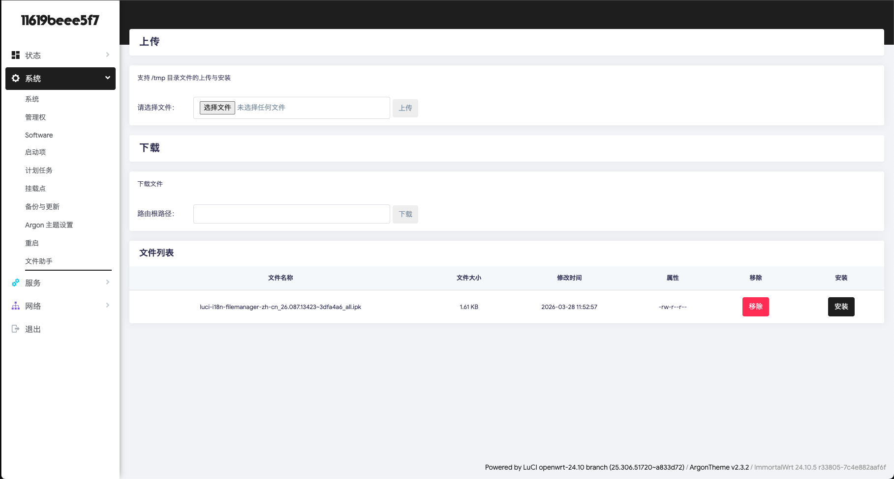
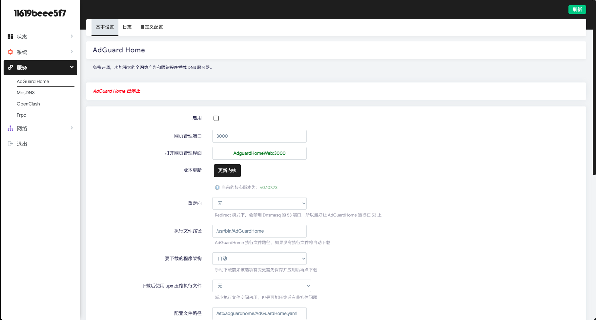
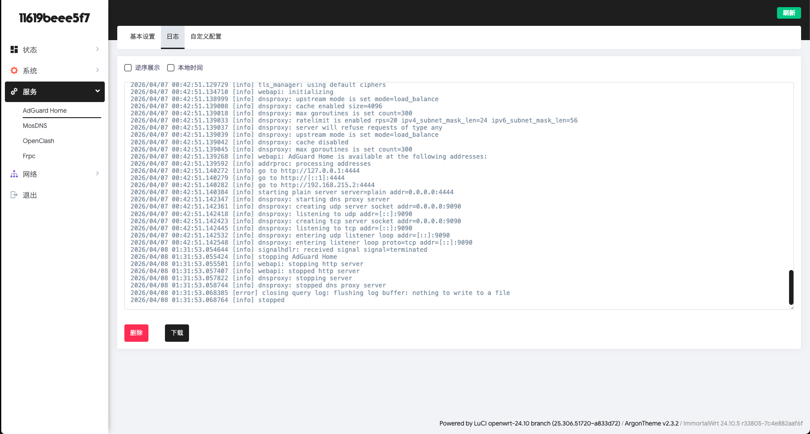
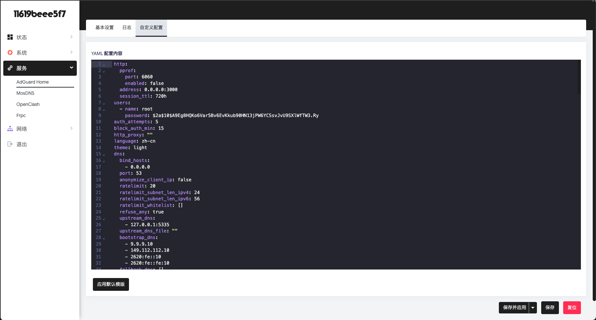
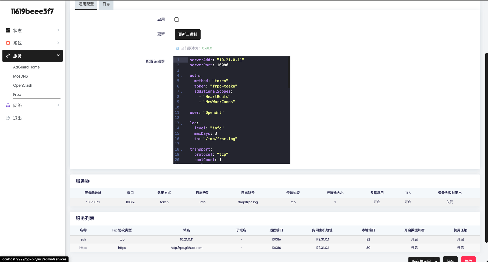

# 🍰 Project Dessert
> "Just like a perfect dessert completes a meal, Project Dessert provides the final, refined touch to your OpenWrt experience."

Welcome to **Project Dessert**! 🍬 This project is born from a simple mission: to ensure that the OpenWrt ecosystem stays as fresh and modern as the hardware it runs on.

### 🌟 Project Vision
As OpenWrt evolves, many classic and beloved plugins have unfortunately stopped receiving updates. **Project Dessert** is committed to keeping pace with OpenWrt’s rapid iterations. We are rewriting legendary, unmaintained projects from the ground up, strictly adhering to:
- ⚡ **The latest JavaScript engines** (ES6+)
- 🛠️ **Native ucode standards**
- 🛡️ **Modern LuCI development patterns**

---

### 🚀 Currently Adapted Plugins
We have successfully modernized and optimized the following packages:
- 📂 **luci-app-filebrowser**: Reimagined file management with a sleek, responsive interface.
- 🛡️ **luci-app-adguardhome**: Clean, powerful, and fully integrated network-wide ad-blocking.
- 🔄 **luci-app-frpc**: High-performance intranet penetration, rewritten for stability.

---

### 🧱 Modern Firewall Architecture (NFTables)
⚠️ **Compatibility Notice:**  
Modern OpenWrt has transitioned from iptables to **nftables**. To ensure peak performance and future-proofing:
- All firewall rules in this project are implemented using **nftables**.
- **iptables is no longer supported.** 🙅‍♂️
- This project is designed specifically for the latest firewall frameworks.

---

### 🎨 Visual Polishing (Optional)
We have included customized optimizations for the popular **luci-theme-argon**. ✨  
*Aesthetics are subjective! These UI enhancements are entirely optional—install them only if they match your personal taste.* 💅

---

### 🛠 Installation via Feeds
This project is structured as a standard **OpenWrt Feed** for seamless integration.

**1. Add the feed to your `feeds.conf.default`:**
```bash
src-git dessert https://github.com/Tubetrue01/dessert.git
```

**2. Update and install:**
```shell
./scripts/feeds update dessert
./scripts/feeds install -a -p dessert
```

### ⚙️ Automated Configuration
For those who love automation, every plugin path includes a config directory. These are designed to help you achieve automated deployments and "zero-touch" configurations. 🤖

### 🥧 Why "Dessert"?
We believe that managing your router shouldn't be a chore—it should be a treat. We stay dedicated to the community by following every OpenWrt update, ensuring your "Dessert" is always sweet and never stale. 🍮✨ believe that managing your router shouldn't be a chore—it should be a treat. We stay dedicated to the community by following eve

### Enjoy your modern OpenWrt journey! 🚀

### luci-app-filemanager


### luci-app-adguardhome




### luci-app-fprc

